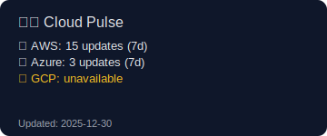
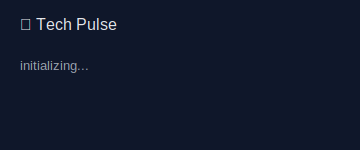
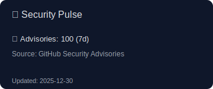

<h1 align="center">👋 Hi, I'm Eddi</h1>

  I enjoy building things that combine <b>clean code</b>, <b>automation</b>, and <b>practical systems</b>.

  

<h2 align="center">🛠️ Tech Stack</h2>

<h2 align="center">📊 Mini Dashboard</h2>

  
  
  

<i>Auto-updated via GitHub Actions</i>

  

  <i>“Build things that last, automate what repeats.”</i>

